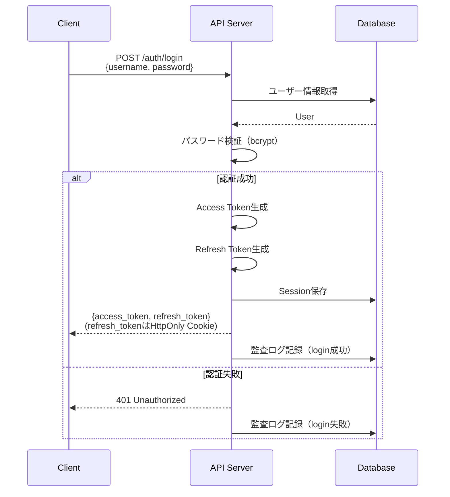
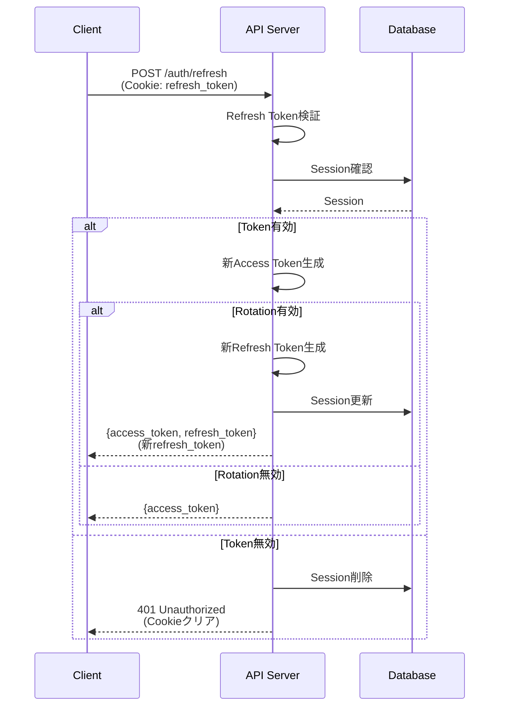
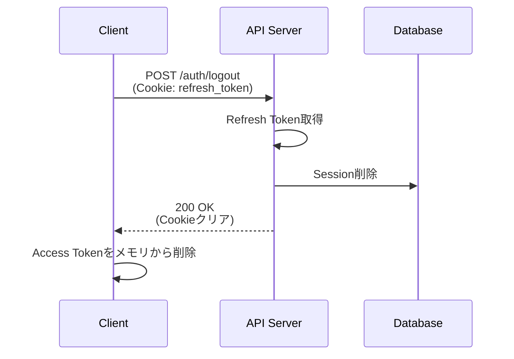

# 認証・認可設計書

このドキュメントでは、Effisioプロジェクトの認証（Authentication）と認可（Authorization）の詳細設計を定義します。

## 目次

- [認証方式](#認証方式)
- [JWT トークン設計](#jwt-トークン設計)
- [認証フロー](#認証フロー)
- [RBAC設計](#rbac設計)
- [セキュリティ対策](#セキュリティ対策)
- [実装ガイド](#実装ガイド)

---

## 認証方式

### 採用方式: JWT (JSON Web Token) + リフレッシュトークン

**選定理由:**
- ステートレス認証が可能（サーバー側でセッション管理不要）
- スケーラビリティが高い
- モバイルアプリへの対応が容易
- マイクロサービス化時の柔軟性

**トークンの種類:**

| トークン種別 | 用途 | 有効期限 | 保存場所 |
|------------|------|---------|---------|
| Access Token | APIアクセス用 | 15分 | メモリ（Zustand） |
| Refresh Token | Access Token更新用 | 7日 | HttpOnly Cookie |

---

## JWT トークン設計

### Access Token 構造

**ヘッダー:**
```json
{
  "alg": "RS256",
  "typ": "JWT"
}
```

**ペイロード（Claims）:**
```json
{
  "sub": "user_id",           // Subject: ユーザーID
  "username": "john_doe",     // ユーザー名
  "email": "john@example.com", // メールアドレス
  "role": "user",             // ロール
  "permissions": [            // 権限リスト
    "users:read",
    "dashboard:read"
  ],
  "iat": 1234567890,          // Issued At: 発行時刻
  "exp": 1234568790,          // Expiration: 有効期限（15分後）
  "iss": "effisio-api",       // Issuer: 発行者
  "aud": "effisio-client"     // Audience: 対象クライアント
}
```

**署名:**
```
RS256(
  base64UrlEncode(header) + "." + base64UrlEncode(payload),
  privateKey
)
```

### Refresh Token 構造

**ペイロード:**
```json
{
  "sub": "user_id",
  "token_id": "uuid-v4",      // トークン識別子
  "iat": 1234567890,
  "exp": 1234972690,          // 有効期限（7日後）
  "iss": "effisio-api",
  "aud": "effisio-client"
}
```

**保存:**
- データベースの `sessions` テーブルに保存
- トークンローテーション有効化時は使用後に新しいトークンを発行

---

## 認証フロー

### 1. ログインフロー



**実装:**

```go
// POST /auth/login
func (h *AuthHandler) Login(c *gin.Context) {
    var req LoginRequest
    if err := c.ShouldBindJSON(&req); err != nil {
        util.ValidationError(c, util.ParseValidationErrors(err))
        return
    }

    // ユーザー検証
    user, err := h.userRepo.FindByUsername(c.Request.Context(), req.Username)
    if err != nil {
        util.Error(c, http.StatusUnauthorized, util.ErrCodeAuthFailed, "Invalid credentials")
        h.auditLog.LogLoginFailed(c, req.Username)
        return
    }

    // パスワード検証
    if err := bcrypt.CompareHashAndPassword([]byte(user.PasswordHash), []byte(req.Password)); err != nil {
        util.Error(c, http.StatusUnauthorized, util.ErrCodeAuthFailed, "Invalid credentials")
        h.auditLog.LogLoginFailed(c, req.Username)
        return
    }

    // 権限取得
    permissions, err := h.permissionService.GetUserPermissions(c.Request.Context(), user.ID)
    if err != nil {
        util.Error(c, http.StatusInternalServerError, util.ErrCodeInternal, "Failed to get permissions")
        return
    }

    // Access Token生成
    accessToken, err := h.jwtService.GenerateAccessToken(user, permissions)
    if err != nil {
        util.Error(c, http.StatusInternalServerError, util.ErrCodeInternal, "Failed to generate token")
        return
    }

    // Refresh Token生成
    refreshToken, sessionID, err := h.jwtService.GenerateRefreshToken(user.ID)
    if err != nil {
        util.Error(c, http.StatusInternalServerError, util.ErrCodeInternal, "Failed to generate refresh token")
        return
    }

    // Session保存
    session := &model.Session{
        ID:           sessionID,
        UserID:       user.ID,
        RefreshToken: refreshToken,
        ExpiresAt:    time.Now().Add(7 * 24 * time.Hour),
        IPAddress:    c.ClientIP(),
        UserAgent:    c.Request.UserAgent(),
    }
    if err := h.sessionRepo.Create(c.Request.Context(), session); err != nil {
        util.Error(c, http.StatusInternalServerError, util.ErrCodeInternal, "Failed to create session")
        return
    }

    // Refresh TokenをHttpOnly Cookieに設定
    c.SetCookie(
        "refresh_token",
        refreshToken,
        7*24*3600, // 7日
        "/",
        "",
        true,  // Secure
        true,  // HttpOnly
    )

    // Last Login更新
    now := time.Now()
    user.LastLogin = &now
    h.userRepo.Update(c.Request.Context(), user)

    // 監査ログ
    h.auditLog.LogLoginSuccess(c, user.ID)

    // レスポンス
    util.Success(c, gin.H{
        "access_token": accessToken,
        "expires_in":   900, // 15分
        "user": user.ToResponse(),
    })
}
```

---

### 2. トークンリフレッシュフロー



**実装:**

```go
// POST /auth/refresh
func (h *AuthHandler) Refresh(c *gin.Context) {
    // Cookieからリフレッシュトークン取得
    refreshToken, err := c.Cookie("refresh_token")
    if err != nil {
        util.Error(c, http.StatusUnauthorized, util.ErrCodeTokenInvalid, "Refresh token not found")
        return
    }

    // トークン検証
    claims, err := h.jwtService.ValidateRefreshToken(refreshToken)
    if err != nil {
        util.Error(c, http.StatusUnauthorized, util.ErrCodeTokenInvalid, "Invalid refresh token")
        return
    }

    // Session確認
    session, err := h.sessionRepo.FindByID(c.Request.Context(), claims.TokenID)
    if err != nil {
        util.Error(c, http.StatusUnauthorized, util.ErrCodeTokenInvalid, "Session not found")
        return
    }

    // Session有効期限確認
    if session.ExpiresAt.Before(time.Now()) {
        h.sessionRepo.Delete(c.Request.Context(), session.ID)
        util.Error(c, http.StatusUnauthorized, util.ErrCodeTokenExpired, "Session expired")
        return
    }

    // ユーザー情報取得
    user, err := h.userRepo.FindByID(c.Request.Context(), session.UserID)
    if err != nil {
        util.Error(c, http.StatusUnauthorized, util.ErrCodeUserNotFound, "User not found")
        return
    }

    // 権限取得
    permissions, err := h.permissionService.GetUserPermissions(c.Request.Context(), user.ID)
    if err != nil {
        util.Error(c, http.StatusInternalServerError, util.ErrCodeInternal, "Failed to get permissions")
        return
    }

    // 新Access Token生成
    newAccessToken, err := h.jwtService.GenerateAccessToken(user, permissions)
    if err != nil {
        util.Error(c, http.StatusInternalServerError, util.ErrCodeInternal, "Failed to generate token")
        return
    }

    response := gin.H{
        "access_token": newAccessToken,
        "expires_in":   900,
    }

    // トークンローテーション（オプション）
    if h.config.JWT.RefreshTokenRotation {
        newRefreshToken, newSessionID, err := h.jwtService.GenerateRefreshToken(user.ID)
        if err != nil {
            util.Error(c, http.StatusInternalServerError, util.ErrCodeInternal, "Failed to generate refresh token")
            return
        }

        // 旧Session削除、新Session作成
        h.sessionRepo.Delete(c.Request.Context(), session.ID)
        newSession := &model.Session{
            ID:           newSessionID,
            UserID:       user.ID,
            RefreshToken: newRefreshToken,
            ExpiresAt:    time.Now().Add(7 * 24 * time.Hour),
            IPAddress:    c.ClientIP(),
            UserAgent:    c.Request.UserAgent(),
        }
        h.sessionRepo.Create(c.Request.Context(), newSession)

        // Cookie更新
        c.SetCookie("refresh_token", newRefreshToken, 7*24*3600, "/", "", true, true)
    }

    util.Success(c, response)
}
```

---

### 3. ログアウトフロー



**実装:**

```go
// POST /auth/logout
func (h *AuthHandler) Logout(c *gin.Context) {
    // Cookieからリフレッシュトークン取得
    refreshToken, err := c.Cookie("refresh_token")
    if err != nil {
        // トークンがなくてもログアウトは成功とする
        c.SetCookie("refresh_token", "", -1, "/", "", true, true)
        util.Success(c, gin.H{"message": "Logged out successfully"})
        return
    }

    // トークン検証（エラーでも続行）
    claims, _ := h.jwtService.ValidateRefreshToken(refreshToken)
    if claims != nil {
        // Session削除
        h.sessionRepo.Delete(c.Request.Context(), claims.TokenID)

        // 監査ログ
        h.auditLog.LogLogout(c, claims.UserID)
    }

    // Cookieクリア
    c.SetCookie("refresh_token", "", -1, "/", "", true, true)

    util.Success(c, gin.H{"message": "Logged out successfully"})
}
```

---

## RBAC設計

### ロールベースアクセス制御 (Role-Based Access Control)

**4つのロール:**

| ロール | 説明 | 主な権限 |
|-------|------|---------|
| admin | システム管理者 | 全ての操作が可能 |
| manager | マネージャー | ユーザー管理、レポート閲覧 |
| user | 一般ユーザー | 基本操作 |
| viewer | 閲覧者 | 読み取りのみ |

### 権限マトリクス

| リソース | admin | manager | user | viewer |
|---------|-------|---------|------|--------|
| users:read | ✓ | ✓ | - | ✓ |
| users:create | ✓ | ✓ | - | - |
| users:update | ✓ | ✓ | 自分のみ | - |
| users:delete | ✓ | - | - | - |
| dashboard:read | ✓ | ✓ | ✓ | ✓ |
| settings:read | ✓ | ✓ | ✓ | - |
| settings:update | ✓ | - | - | - |
| audit_logs:read | ✓ | ✓ | - | - |

### 権限チェックの実装

**ミドルウェア方式:**

```go
// 特定の権限を要求
func RequirePermission(permission string) gin.HandlerFunc {
    return func(c *gin.Context) {
        permissions, exists := c.Get("permissions")
        if !exists {
            util.Error(c, http.StatusForbidden, util.ErrCodePermissionDenied, "Permissions not found")
            c.Abort()
            return
        }

        userPermissions := permissions.([]string)
        for _, p := range userPermissions {
            if p == permission {
                c.Next()
                return
            }
        }

        util.Error(c, http.StatusForbidden, util.ErrCodePermissionDenied, "Insufficient permissions")
        c.Abort()
    }
}

// 使用例
router.GET("/users",
    authMiddleware.RequireAuth(),
    RequirePermission("users:read"),
    userHandler.List,
)
```

**サービス層でのチェック:**

```go
func (s *UserService) Update(ctx context.Context, userID uint, targetID uint, req *UpdateUserRequest) error {
    // コンテキストから権限取得
    permissions := ctx.Value("permissions").([]string)

    // 自分自身の更新か確認
    if userID == targetID {
        // 自分自身の更新は許可
    } else if !hasPermission(permissions, "users:update") {
        return util.NewAppError(http.StatusForbidden, util.ErrCodePermissionDenied, "Cannot update other users", nil)
    }

    // 更新処理...
}

func hasPermission(permissions []string, required string) bool {
    for _, p := range permissions {
        if p == required {
            return true
        }
    }
    return false
}
```

---

## セキュリティ対策

### 1. パスワードセキュリティ

**ハッシュ化:**
```go
import "golang.org/x/crypto/bcrypt"

// パスワードハッシュ化（cost=10）
func HashPassword(password string) (string, error) {
    hash, err := bcrypt.GenerateFromPassword([]byte(password), bcrypt.DefaultCost)
    if err != nil {
        return "", err
    }
    return string(hash), nil
}

// パスワード検証
func VerifyPassword(hash, password string) error {
    return bcrypt.CompareHashAndPassword([]byte(hash), []byte(password))
}
```

**パスワードポリシー:**
- 最低8文字
- 英大文字、英小文字、数字、記号を各1文字以上含む
- 過去3回のパスワードと異なること（将来実装）
- 90日ごとに変更推奨（将来実装）

### 2. レート制限

**実装:**
```go
import "github.com/ulule/limiter/v3"
import "github.com/ulule/limiter/v3/drivers/store/redis"

// ログインエンドポイントのレート制限
// 1分間に5回まで
func RateLimitLogin() gin.HandlerFunc {
    rate := limiter.Rate{
        Period: 1 * time.Minute,
        Limit:  5,
    }

    store := redis.NewStore(redisClient)
    instance := limiter.New(store, rate)

    return func(c *gin.Context) {
        key := c.ClientIP() // IPアドレスをキーに使用
        context, err := instance.Get(c.Request.Context(), key)
        if err != nil {
            util.Error(c, http.StatusInternalServerError, util.ErrCodeInternal, "Rate limit error")
            c.Abort()
            return
        }

        if context.Reached {
            util.Error(c, http.StatusTooManyRequests, "RATE_LIMIT_EXCEEDED", "Too many requests")
            c.Abort()
            return
        }

        c.Next()
    }
}
```

### 3. CSRF対策

**トークン方式:**
- ステートフルセッションの場合はCSRFトークンを使用
- JWTの場合はDouble Submit Cookie パターンを使用

**実装（Double Submit Cookie）:**
```go
func CSRFMiddleware() gin.HandlerFunc {
    return func(c *gin.Context) {
        if c.Request.Method == "GET" || c.Request.Method == "HEAD" || c.Request.Method == "OPTIONS" {
            c.Next()
            return
        }

        // Cookieからトークン取得
        cookieToken, err := c.Cookie("csrf_token")
        if err != nil {
            util.Error(c, http.StatusForbidden, "CSRF_TOKEN_MISSING", "CSRF token missing")
            c.Abort()
            return
        }

        // ヘッダーからトークン取得
        headerToken := c.GetHeader("X-CSRF-Token")
        if headerToken == "" {
            util.Error(c, http.StatusForbidden, "CSRF_TOKEN_MISSING", "CSRF token missing")
            c.Abort()
            return
        }

        // トークン比較
        if cookieToken != headerToken {
            util.Error(c, http.StatusForbidden, "CSRF_TOKEN_INVALID", "CSRF token invalid")
            c.Abort()
            return
        }

        c.Next()
    }
}
```

### 4. XSS対策

- レスポンスに適切なContent-Typeヘッダーを設定
- X-Content-Type-Options: nosniff を設定
- Content-Security-Policy ヘッダーを設定

```go
func SecurityHeadersMiddleware() gin.HandlerFunc {
    return func(c *gin.Context) {
        c.Header("X-Content-Type-Options", "nosniff")
        c.Header("X-Frame-Options", "DENY")
        c.Header("X-XSS-Protection", "1; mode=block")
        c.Header("Content-Security-Policy", "default-src 'self'")
        c.Header("Strict-Transport-Security", "max-age=31536000; includeSubDomains")
        c.Next()
    }
}
```

### 5. セッション管理

**セッションの有効期限:**
- Refresh Token: 7日
- Access Token: 15分
- 期限切れセッションの自動削除（定期実行）

**セッション無効化:**
```go
// 全セッション無効化（パスワード変更時等）
func (r *SessionRepository) DeleteAllByUserID(ctx context.Context, userID uint) error {
    return r.db.WithContext(ctx).
        Where("user_id = ?", userID).
        Delete(&model.Session{}).Error
}

// 特定セッション無効化
func (r *SessionRepository) Delete(ctx context.Context, sessionID string) error {
    return r.db.WithContext(ctx).
        Delete(&model.Session{}, "id = ?", sessionID).Error
}
```

---

## 実装ガイド

### JWTサービスの実装

`internal/service/jwt.go`:

```go
package service

import (
    "time"
    "github.com/golang-jwt/jwt/v5"
    "github.com/google/uuid"
    "github.com/varubogu/effisio/backend/internal/model"
)

type JWTService struct {
    accessSecret  []byte
    refreshSecret []byte
    issuer        string
    audience      string
}

func NewJWTService(accessSecret, refreshSecret, issuer, audience string) *JWTService {
    return &JWTService{
        accessSecret:  []byte(accessSecret),
        refreshSecret: []byte(refreshSecret),
        issuer:        issuer,
        audience:      audience,
    }
}

type AccessTokenClaims struct {
    UserID      uint     `json:"user_id"`
    Username    string   `json:"username"`
    Email       string   `json:"email"`
    Role        string   `json:"role"`
    Permissions []string `json:"permissions"`
    jwt.RegisteredClaims
}

type RefreshTokenClaims struct {
    UserID  uint   `json:"user_id"`
    TokenID string `json:"token_id"`
    jwt.RegisteredClaims
}

// GenerateAccessToken はアクセストークンを生成
func (s *JWTService) GenerateAccessToken(user *model.User, permissions []string) (string, error) {
    claims := AccessTokenClaims{
        UserID:      user.ID,
        Username:    user.Username,
        Email:       user.Email,
        Role:        user.Role,
        Permissions: permissions,
        RegisteredClaims: jwt.RegisteredClaims{
            ExpiresAt: jwt.NewNumericDate(time.Now().Add(15 * time.Minute)),
            IssuedAt:  jwt.NewNumericDate(time.Now()),
            Issuer:    s.issuer,
            Audience:  jwt.ClaimStrings{s.audience},
            Subject:   fmt.Sprintf("%d", user.ID),
        },
    }

    token := jwt.NewWithClaims(jwt.SigningMethodHS256, claims)
    return token.SignedString(s.accessSecret)
}

// GenerateRefreshToken はリフレッシュトークンを生成
func (s *JWTService) GenerateRefreshToken(userID uint) (string, string, error) {
    tokenID := uuid.New().String()

    claims := RefreshTokenClaims{
        UserID:  userID,
        TokenID: tokenID,
        RegisteredClaims: jwt.RegisteredClaims{
            ExpiresAt: jwt.NewNumericDate(time.Now().Add(7 * 24 * time.Hour)),
            IssuedAt:  jwt.NewNumericDate(time.Now()),
            Issuer:    s.issuer,
            Audience:  jwt.ClaimStrings{s.audience},
            Subject:   fmt.Sprintf("%d", userID),
        },
    }

    token := jwt.NewWithClaims(jwt.SigningMethodHS256, claims)
    signedToken, err := token.SignedString(s.refreshSecret)
    if err != nil {
        return "", "", err
    }

    return signedToken, tokenID, nil
}

// ValidateAccessToken はアクセストークンを検証
func (s *JWTService) ValidateAccessToken(tokenString string) (*AccessTokenClaims, error) {
    token, err := jwt.ParseWithClaims(tokenString, &AccessTokenClaims{}, func(token *jwt.Token) (interface{}, error) {
        return s.accessSecret, nil
    })

    if err != nil || !token.Valid {
        return nil, err
    }

    claims, ok := token.Claims.(*AccessTokenClaims)
    if !ok {
        return nil, errors.New("invalid token claims")
    }

    return claims, nil
}

// ValidateRefreshToken はリフレッシュトークンを検証
func (s *JWTService) ValidateRefreshToken(tokenString string) (*RefreshTokenClaims, error) {
    token, err := jwt.ParseWithClaims(tokenString, &RefreshTokenClaims{}, func(token *jwt.Token) (interface{}, error) {
        return s.refreshSecret, nil
    })

    if err != nil || !token.Valid {
        return nil, err
    }

    claims, ok := token.Claims.(*RefreshTokenClaims)
    if !ok {
        return nil, errors.New("invalid token claims")
    }

    return claims, nil
}
```

---

## 監査ログ

### ログ記録対象

- ログイン成功/失敗
- ログアウト
- パスワード変更
- ユーザー作成/更新/削除
- 権限変更
- 重要データの閲覧/変更

### 実装例

```go
type AuditLogService struct {
    repo   *repository.AuditLogRepository
    logger *zap.Logger
}

func (s *AuditLogService) LogLoginSuccess(c *gin.Context, userID uint) {
    log := &model.AuditLog{
        UserID:       &userID,
        Action:       "login",
        ResourceType: "auth",
        IPAddress:    c.ClientIP(),
        UserAgent:    c.Request.UserAgent(),
    }
    s.repo.Create(context.Background(), log)
}

func (s *AuditLogService) LogLoginFailed(c *gin.Context, username string) {
    log := &model.AuditLog{
        Action:       "login_failed",
        ResourceType: "auth",
        NewValues:    map[string]interface{}{"username": username},
        IPAddress:    c.ClientIP(),
        UserAgent:    c.Request.UserAgent(),
    }
    s.repo.Create(context.Background(), log)
}
```

---

## セキュリティチェックリスト

実装時に以下を確認：

- [ ] パスワードはbcryptでハッシュ化している
- [ ] JWT トークンは安全に署名されている
- [ ] Refresh Token は HttpOnly Cookie に保存
- [ ] Access Token はメモリに保存（LocalStorageに保存しない）
- [ ] HTTPS を使用している
- [ ] レート制限を実装している
- [ ] CSRF 対策を実装している
- [ ] セキュリティヘッダーを設定している
- [ ] 監査ログを記録している
- [ ] セッションの有効期限を適切に設定している
- [ ] エラーメッセージで機密情報を漏らしていない
- [ ] SQL インジェクション対策（ORMの適切な使用）
- [ ] XSS 対策（適切なエスケープ）

---

## 変更履歴

| 日付 | バージョン | 変更内容 |
|------|-----------|---------|
| 2024-01-16 | 1.0.0 | 初版作成 |
